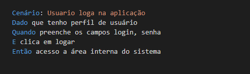
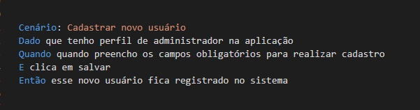
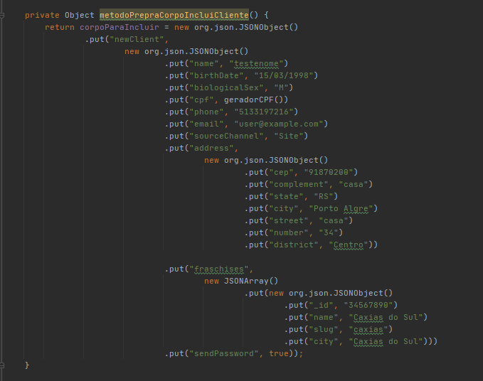
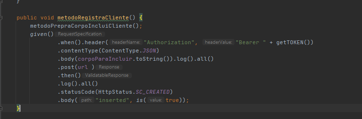
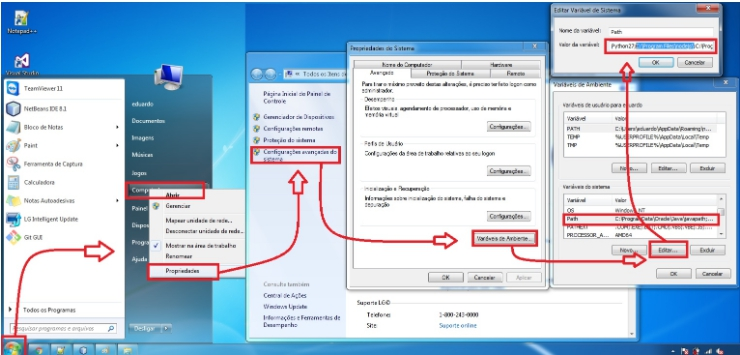
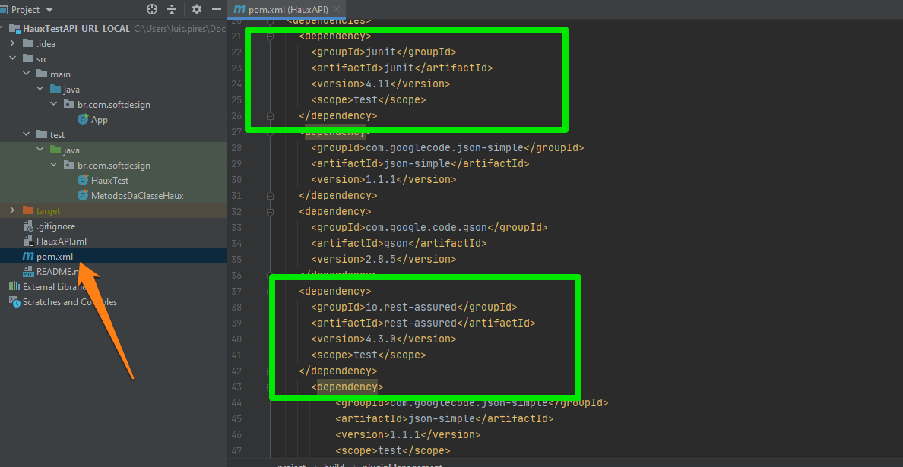

## Projeto para testes automatizados com Rst Assured 

#### Um pouco sobre a aplicação onde serão feitos os testes
 

  

Reportagem de:
Babiana Mugnol, babiana.mugnol@rdgaucha.com.br

Após vender a rede Croasonho em 2017, quando o negócio se tornou uma cadeia com 80 lojas em 17 Estados, os idealizadores voltam a campo com projeto inovador de franquia na área de saúde.
Eduardo Silva e Gustavo Susin inauguram, na próxima terça-feira, a Haux, um projeto de R$ 5 milhões com a primeira clínica-modelo em Caxias. A parceria é com o médico Clayton Macedo, doutor em endocrinologia clínica, e outros sócios. O potencial mapeado para expansão é de mais de 200 unidades em cidades acima de 60 mil habitantes no Brasil.
O novo modelo de franquia é focado em mudança intensiva de estilo de vida. A Haux abrirá na Rua Moreira César, 2.229, para trabalhar  a prevenção e o tratamento do excesso de peso, do diabetes e de doenças cardiovasculares. A estrutura também conta com academia. A nova marca será apresentada de forma online no dia 1º de setembro, às 19h,  com mediação da jornalista Laura Medina, especializada em saúde e bem-estar.

### Técnicas para testa a aplicação
Para validar um sistema com inumeros cenários de teste como neste caso, é preciso ganhar velocidade, mas sem abrir mão também da qualidade. Os testes vou apresentar são apenas dois um pouco para demostrar como tirar proveito das técnicas de BDD e posteriormente apresentarei o desenvolvimento em selenium.

### BDD como isso vai ajudar?
BDD é uma técnica de desenvolvimento de software ágil que surge através de uma crítica de Dan North ao Test Driven Development(Desenvolvimento orientado a testes), onde ele visava otimizar o conceito de ‘verificação e validação’ já aplicado, e tornar mais eficiente a construção de cenários a serem testados e/ou desenvolvidos.

### BDD cenário 1

### Como fica após atomatizar o cenário 1 com Rest Assured e JUnit

## BDD cenário 2

## Como fica após atomatizar o cenário 2 com Rest Assured e JUnit 
#### Para manter mais organizado o código fiz em duas etapas esse registro primeiro eu coloquei as informações necessarias para ser registrado esse usuário  

#### Após isso eu realizo o cadastro desse novo usuário passando no body a estrutura que havia preparado anteriormento uma forma de identificar que estou realizando um registro é atraves do verbo POST antes do THEN().

## Intalações necessarias para esse projeto

Java versão 8 Update 261r

IntelliJ IDEA Community Edition 2020.14

###### Lembrar de configurar variaveis de ambiente

## Características Rest Assured:
##### O Rest Assured nos permite testar serviços RESTful em Java de um jeito muito mais prático, basicamente, ele nos provê uma maneira de criar chamadas HTTP, como se fôssemos um cliente acessando a API. Suporta os métodos POST, GET, PUT, DELETE, OPTIONS, PATCH e HEAD e pode ser usado para validar e verificar a resposta dessas solicitações.

## Características JUnit: 
Origem: Wikipédia, a enciclopédia livre.

Saltar para a navegaçãoSaltar para a pesquisa
O JUnit é um framework open-source, que se assemelha ao raio de testes software java, criado por Erich Gamma e Kent Beck, com suporte à criação de testes automatizados na linguagem de programação Java.

Esse framework facilita a criação e manutenção do código para a automação de testes com apresentação dos resultados. Com ele, pode ser verificado se cada método de uma classe funciona da forma esperada, exibindo possíveis erros ou falhas podendo ser utilizado tanto para a execução de baterias de testes como para extensão.

Com JUnit, o programador tem a possibilidade de usar esta ferramenta para criar um modelo padrão de testes, muitas vezes de forma automatizada.

O teste de unidade testa o menor dos componentes de um sistema de maneira isolada. Cada uma dessas unidades define um conjunto de estímulos (chamada de métodos), e de dados de entrada e saída associados a cada estímulo. As entradas são parâmetros e as saídas são o valor de retorno, exceções ou o estado do objeto. Tipicamente um teste unitário executa um método individualmente e compara uma saída conhecida após o processamento da mesma. 

## Comandos Rest Assured
O Rest Assured nos permite testar serviços RESTful em Java de um jeito muito mais prático, basicamente, ele nos provê uma maneira de criar chamadas HTTP, como se fôssemos um cliente acessando a API. Suporta os métodos POST, GET, PUT, DELETE, OPTIONS, PATCH e HEAD e pode ser usado para validar e verificar a resposta dessas solicitações.

## Instalação através do gerenciador de dependências Maven: 

Utilizei o Maven para facilitar a vida, ele vai cuidar da parte de gerenciamento de dependências. 

## Algumas vantagens de se utilizar JUnit:
Permite a criação rápida de código de teste enquanto possibilita um aumento na qualidade do sistema sendo desenvolvido e testado;
Não é necessário escrever o próprio framework;
Amplamente utilizado pelos desenvolvedores da comunidade código-aberto, possuindo um grande número de exemplos;
Uma vez escritos, os testes são executados rapidamente sem que, para isso, seja interrompido o processo de desenvolvimento;
JUnit checa os resultados dos testes e fornece uma resposta imediata;
Pode-se criar uma hierarquia de testes que permitirá testar apenas uma parte do sistema ou todo ele;
Escrever testes com JUnit permite que o programador perca menos tempo depurando seu código;
JUnit é LIVRE.

## Links 

	devmedia.com.br   https://www.devmedia.com.br/introducao-aos-testes-funcionais-automatizados-com-junit-e-selenium-webdriver/28037
	junit.org         https://junit.org/junit5/docs/current/user-guide/
	wikipedia.org     https://pt.wikipedia.org/wiki/JUnit
        genbeta           https://www.genbeta.com/desarrollo/rest-assured-framework-para-testear-y-validar-nuestros-servicios-rest
        Babiana Mugnol    pioneiro.clicrbs.com.br/rs/economia/caixa-forte/noticia/2020/08/idealizadores-de-franquia-nacional-com-novo-sonho-13001085.html

	
	
 
